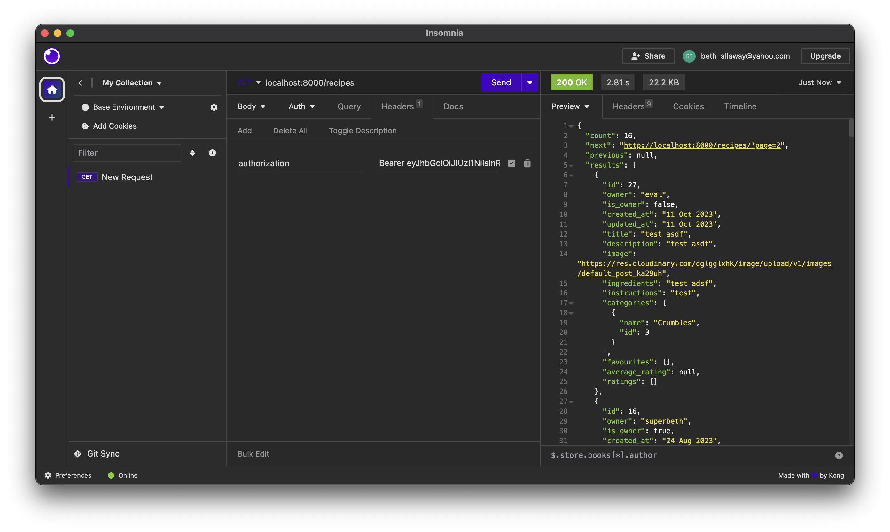

# Cakes Cookies and Crumbles

## Contents

- [**Model Relationship Diagram**](#model-relationship-diagram)
- [**Local Development**](#local-development)
- [**Local Development**](#testing)


## Model Relationship Diagram
This is a diagram I created on what the relationship looks like between the models on my backend.

## Local Development
To run the application locally, I used the below command to start the server in the terminal.
```
$ python3 manage.py runserver
```

## Linting
I installed a PyLint extention for VSCode that listed problems with linting. I then had to fix manually.
See below for examples of pylinting issues that I have fixed.


The image below shows some issues that I couldn't fix.


## Testing
### Create Recipe
I made an API request on the recipes end point and this returned back a 400 bad request. This is because there are validation errors. In the example below, you can see the errors from the server.
  

I made an API request on the recipes end point and this returned back a 201 success. In the response is my recipe in JSON


### Edit Recipe
I made a PUT API request to the recipes/29/ end point where 29 is the ID of the created test recipe from the last example.
It has returned back a 200 and make a note that I have changed the ingredients from "milk" to "custard and bread crumbs".


### Delete Recipe
I made a DELETE API request on the recipes end point and this returned back a  204 no content. This means that the recipe I created, was deleted sucessfully.

### Favourite Recipe        
### Paginate Recipe
I made an API request to the recipes end point and this returned back a paginated result where I had a count property for the total amount of recipes, next and previous properties for next and previous page URLS and a results property for the array of recipes. 


### Recipe Filters
I made an API request to the recipes end point with a query parameter for categories with the category `Cakes`.
This returned a paginated response where all recipes had a `Cakes` category. 


### Recipe Favourite Pagination.
I made an API request to the recipes end point with a query parameter for `isFavourited` set to True. This returned a paginated response where all recipes returned contained a favourite relationship for the signed in user.


### Recipe Rating
I made POST API request to the ratings end point with a payload for recipe with ID 4 and my rating of 7. This returned back a 400 response which is to be expected as my rating value is higher than the maximum.


I made a POST API request to the ratings end point with the same payload as above and changed the value to 4, within the validation rules. This returned back a 201 status code and the body of my rating model.


I tried to make the same request as above but received a 400 response because I cannot create duplicates.


