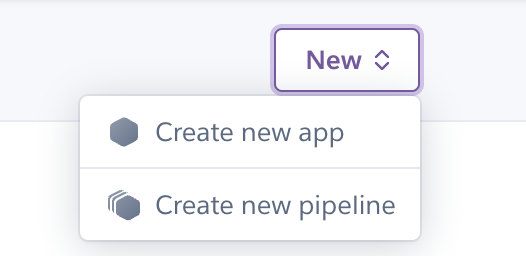

# Cakes Cookies and Crumbles

## Contents

- [**Model Relationship Diagram**](#model-relationship-diagram)
- [**Local Development**](#local-development)
- [**Linting**](#linting)
- [**Testing**](#testing)
- [**Deployment to Heroku**](#deployment-to-heroku)


## Model Relationship Diagram
This is a diagram I created on what the relationship looks like between the models on my backend.


### User
This table is supplied by Django it is used to hold user information such as email address and password.
The userID will be used to create relations on models that the user owns. 
### Recipes
This model stores the recipe information such as the title, ingredients and instructions etc. The recipe will belong to a user.
### Categories
This model stores the filter categories that help the user find a specific recipe that they desire. (Cakes, Cookies and Categories). The user can assign more than one category to a recipe.
### Ratings
Ratings has a relation to the user and the recipe and has the value for the recipe's rating (1-5).
This is later used to calculate the recipes average rating.
### Favourites
This is used to mark a specific recipes as favourited by the user this is so the user can find their favourites using the relationship.
## Local Development
To run the application locally, I used the below command to start the server in the terminal.
```
$ python3 manage.py runserver
```

## Linting
I installed a PyLint extention for VSCode that listed problems with linting. I then had to fix manually.
See below for examples of pylinting issues that I have fixed.


The image below shows some issues that I couldn't fix.


## Testing
### Create Recipe
I made an API request on the recipes end point and this returned back a 400 bad request. This is because there are validation errors. In the example below, you can see the errors from the server.
  

I made an API request on the recipes end point and this returned back a 201 success. In the response is my recipe in JSON


### Edit Recipe
I made a PUT API request to the recipes/29/ end point where 29 is the ID of the created test recipe from the last example.
It has returned back a 200 and make a note that I have changed the ingredients from "milk" to "custard and bread crumbs".


### Delete Recipe
I made a DELETE API request on the recipes end point and this returned back a  204 no content. This means that the recipe I created, was deleted sucessfully.

### Favourite Recipe        
### Paginate Recipe
I made an API request to the recipes end point and this returned back a paginated result where I had a count property for the total amount of recipes, next and previous properties for next and previous page URLS and a results property for the array of recipes. 


### Recipe Filters
I made an API request to the recipes end point with a query parameter for categories with the category `Cakes`.
This returned a paginated response where all recipes had a `Cakes` category. 


### Recipe Favourite Pagination.
I made an API request to the recipes end point with a query parameter for `isFavourited` set to True. This returned a paginated response where all recipes returned contained a favourite relationship for the signed in user.


### Recipe Rating
I made POST API request to the ratings end point with a payload for recipe with ID 4 and my rating of 7. This returned back a 400 response which is to be expected as my rating value is higher than the maximum.


I made a POST API request to the ratings end point with the same payload as above and changed the value to 4, within the validation rules. This returned back a 201 status code and the body of my rating model.


I tried to make the same request as above but received a 400 response because I cannot create duplicates.


## Deployment to Heroku 
1. First, I clone the repository from GitHub.
<br>
2. Then I copied the SSH link.
<br>
3. I then used the git clone command to clone to my local machine.
<br>


This is how I deployed the backend of this site to Heroku
4. I Created a new app on Heroku
<br>
5. I gave the app a unique name and chosen the region where I am from.
<br>
6. I then linked my Github backend repository to Heroku.
<br>
7. I then inputted all the necessary config vars to Heroku.
<br>
8. I input the Python buildback.
<br>
9. I created the Procfile that so Heroku knows what profile to run? 
<br>
10. I chosen to deploy the main branch.
<br>
11. I added the Heroku app host to my origins for CORS.
<br>
